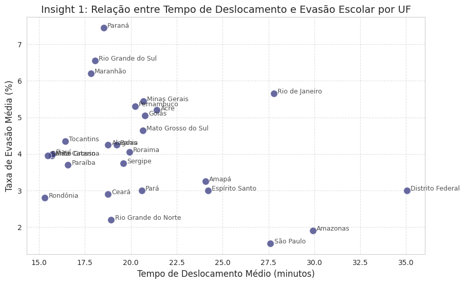
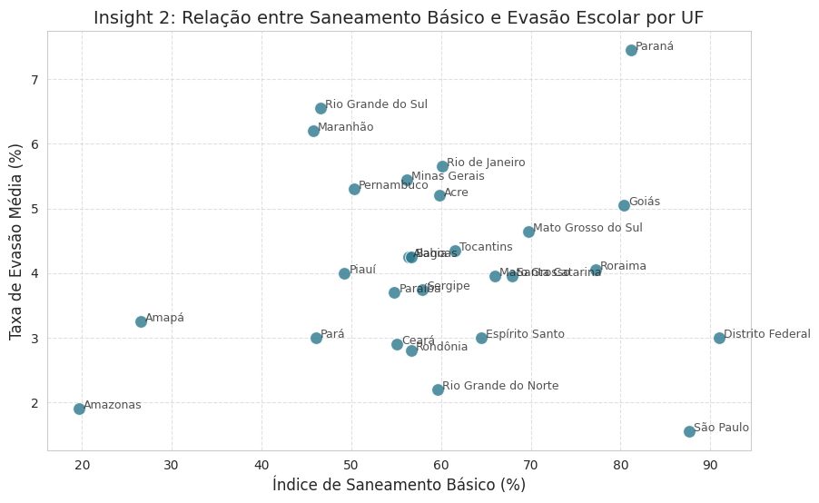
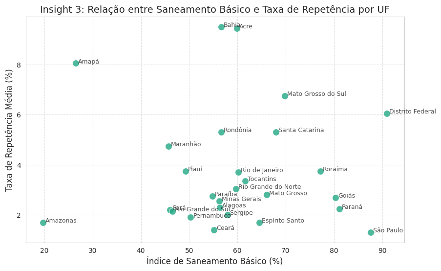
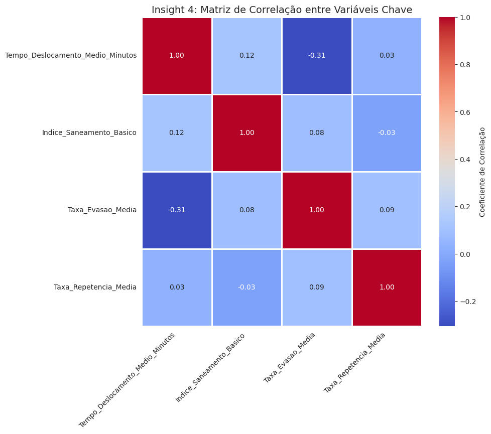
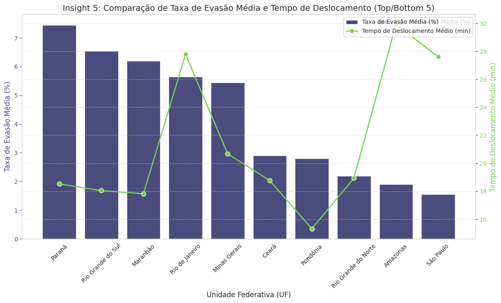
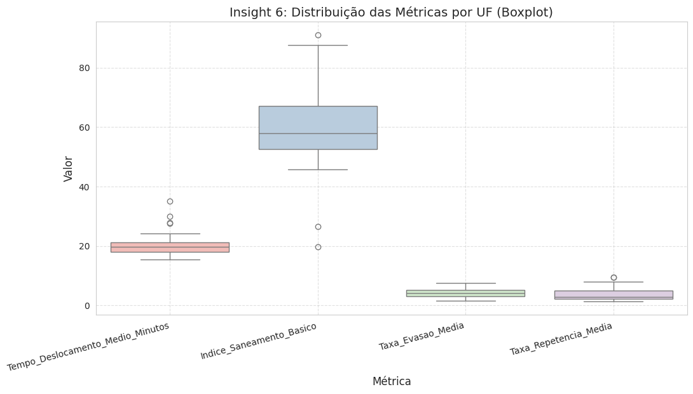
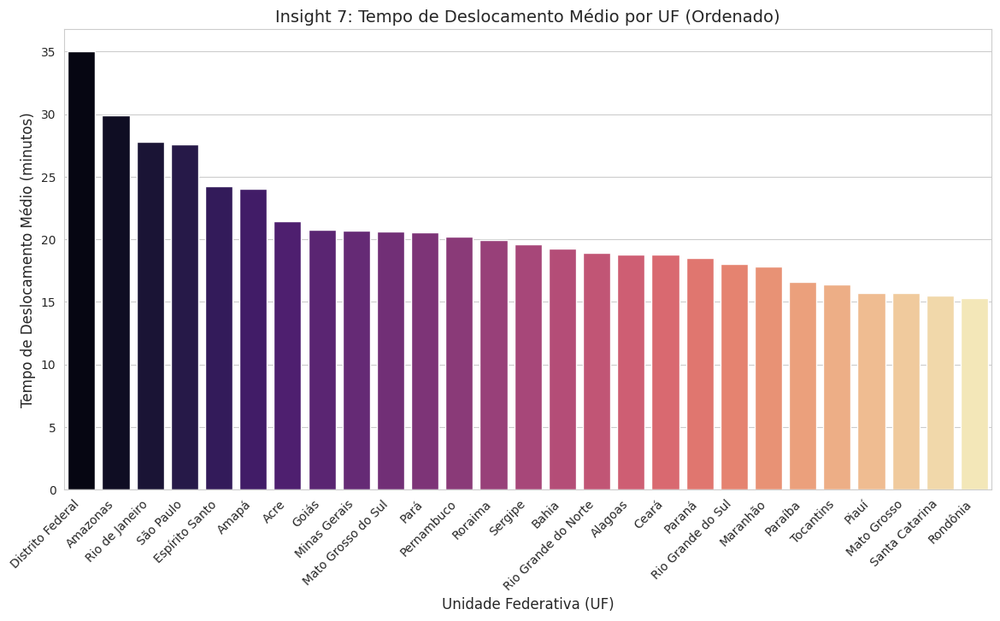
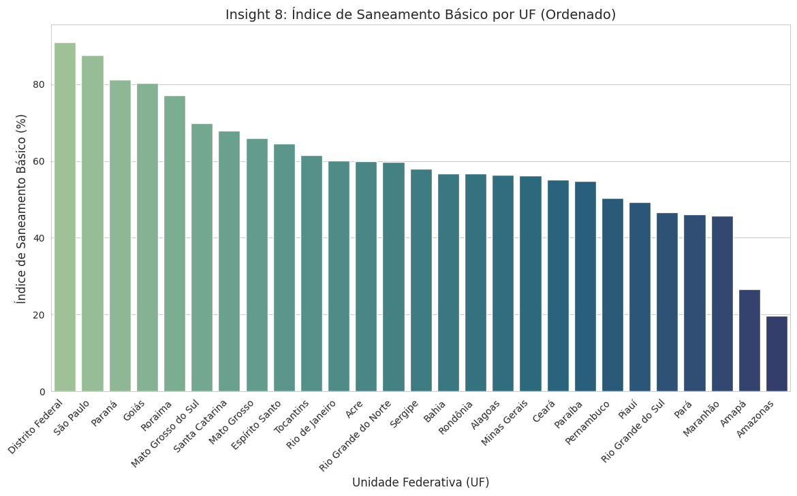
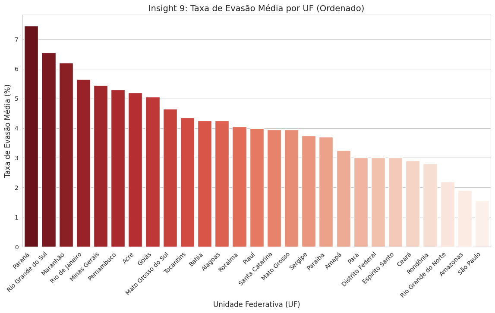

[](https://git.io/typing-svg)


### Meios de comunicação: 
<a href="https://www.linkedin.com/in/gustavo-teodoro-55917b282/" target="_blank"></a> <a href = "mailto:gustavo.teodoro1@estudante.ufla.br"></a>

[](https://github.com/tteodorogustavo/zetta-lab)
[]()
[](./notebooks/)


---

## 1. Introdução e Objetivo do Projeto

Este projeto foi desenvolvido como parte do **Desafio de Ciência e Governança de Dados**, com o objetivo de explorar a relação entre fatores socioeconômicos e o desempenho escolar de jovens brasileiros. O desafio busca demonstrar a capacidade de **adquirir, organizar, explorar e visualizar dados** para fundamentar análises e insights.

O foco central é a fase de **Visualização de Insights**, onde dados de **Deslocamento** e **Saneamento Básico** foram cruzados com **Índices de Ensino** (Evasão e Repetência) para identificar correlações e padrões a nível estadual (UF).

---

## 2. Pergunta Central

A análise busca responder à seguinte questão, que foi definida para ser **específica e mensurável** com os dados disponíveis:

> **"Como a necessidade de deslocamento e as condições de moradia (saneamento básico) podem impactar jovens de 10 a 17 anos e seus respectivos desempenhos escolares, taxas de evasão e repetência?"**

---

## 3. Aquisição e Escolha dos Dados

A **clareza na escolha e aquisição dos dados** é um critério fundamental do desafio. A seleção dos datasets foi guiada pela necessidade de cobrir as três dimensões da pergunta de negócio (deslocamento, moradia e impacto escolar), focando na granularidade por Unidade Federativa (UF) para permitir a integração. Além disso, priorizei dados de 2022 para manter a granularidade de dada e assim extrair insights temporais mais fidedignos.

| Arquivo | Fonte Original (URL/Órgão) | Justificativa da Escolha |
| :--- | :--- | :--- |
| `Deslocamento_Enriquecido_com_UF_e_Codigos.csv` | Essa tabela foi construída a partir de demais tabelas do Censo demográfico de 2022 do IBGE | Representa o fator de **acessibilidade** e o tempo gasto no percurso casa-escola, um indicador de barreira à educação. |
| `Saneamento.csv` | Essa tabela parte de uma BigQuerry no site Base dos Dados, no entanto a origem dela é o Sistema Nacional de Informações sobre Saneamento (SNIS) | Indicador direto da **condição de moradia** e bem-estar (critério do desafio), com forte correlação em estudos socioeconômicos com o desempenho escolar. |
| `indicesEnsino.csv` | Esse arquivo CSV foi extraído a partir do site Base dos Dados, mais especificamente dos Indicadores Educacionais do INEP | Fornece as métricas de **impacto** (Evasão e Repetência) necessárias para avaliar o desempenho escolar dos jovens, conforme solicitado na pergunta de negócio. |

---


## 3. Fontes de Dados e Documentação

| IBGE | INEP | SNIS |
|:---:|:---:|:---:|
|  |  |  |
| **Censo Demográfico 2022** | **Indicadores Educacionais** | **Sistema Nacional de Informações sobre Saneamento** |
| [Acessar Dados](https://www.ibge.gov.br/estatisticas/sociais/populacao/22827-censo-demografico-2022.html) | [Acessar Dados](https://www.gov.br/inep/pt-br/acesso-a-informacao/dados-abertos/indicadores-educacionais) | [Acessar Dados](http://www.snis.gov.br/painel-informacoes-saneamento-brasil) |


| Portal Dos Dados Abertos | Base dos Dados |
|:---:|:---:|
| |  |
| [Acessar site](https://basedosdados.org/) | [Acessar site](https://dados.gov.br/) |


##  4. Processamento e Limpeza de Dados

A **qualidade da análise exploratória e tratamento dos dados** é um critério chave. O processo de limpeza e preparação foi detalhado nos notebooks e resumido abaixo, com foco na **Justificativa** de cada transformação, que é fundamental para a reprodutibilidade e clareza do processo.

### 4.1. Agregação e Transformação

| Arquivo | Processamento Aplicado | Justificativa e Detalhe do Código | Resultado |
| :--- | :--- | :--- | :--- |
| `Deslocamento` | Cálculo do **Tempo de Deslocamento Médio Ponderado** por UF. | **Justificativa:** As faixas de tempo (`Até cinco minutos`, `Mais de uma hora`, etc.) foram mapeadas para seus pontos centrais (`2.5`, `90`, etc.). A média foi calculada usando a coluna `Pessoas` como **peso**, garantindo que a média represente o tempo médio real por pessoa. | `Tempo_Deslocamento_Medio_Minutos` |
| `Saneamento` | Cálculo do **Índice de Saneamento Básico** (média entre coleta e tratamento de esgoto) por UF. | **Justificativa:** Utilizar a média entre `indice_coleta_esgoto` e `indice_tratamento_esgoto` fornece um indicador mais robusto e abrangente da qualidade do saneamento em cada UF, mitigando a dependência de apenas um índice. | `Indice_Saneamento_Basico` |
| `Ensino` | Filtragem por `localizacao == 'Total'` e `rede == 'Total'`, e cálculo da **Taxa Média** de Evasão e Repetência (média entre EF e EM). | **Justificativa:** O filtro garante que a análise seja feita apenas com os valores **totais** por UF, evitando duplicação e focando na taxa geral. O cálculo da média entre Ensino Fundamental (EF) e Médio (EM) reflete o desempenho do público-alvo (10-17 anos). | `Taxa_Evasao_Media` e `Taxa_Repetencia_Media` |

### 4.2 Tratamento do arquivo Deslocamento.csv

O arquivo `Deslocamento.csv` apresenta um formato de relatório que utiliza uma estratégia de pivotagem (formato "largo"). Para transformá-lo em uma tabela analítica, foram necessárias várias etapas de limpeza e transformação, conforme descrito no notebook `clean-data.ipynb`.

#### Etapas do Processo de Limpeza e Transformação:

1. **Leitura e Correção do Cabeçalho**:
    - As linhas 5 e 6 do arquivo, que contêm os cabeçalhos, foram lidas como texto.
    - Correções manuais foram aplicadas utilizando `str.replace()`, como a alteração de "Até, cinco minutos" para "Até cinco minutos".

2. **Combinação de Cabeçalho**:
    - Os dois níveis de cabeçalho (ex: "Até cinco minutos" e "Total, Sem instrução") foram combinados em um cabeçalho único e descritivo, resultando em "Até cinco minutos | Total".

3. **Lógica de Preenchimento (ffill)**:
    - As colunas de índice (Região Geográfica Intermediária, Grupo de idade) apresentavam valores mesclados, com um valor seguido de células nulas.
    - A função `ffill()` foi aplicada para preencher corretamente essas lacunas antes de qualquer limpeza.

4. **Limpeza (dropna)**:
    - Após o preenchimento, todas as linhas onde a coluna "Cor ou raça" era nula foram removidas.
    - Esta etapa foi crucial para eliminar linhas de subtotal e cabeçalhos residuais, preservando os dados de observação.

5. **Filtragem de Dados**:
    - O DataFrame foi filtrado para manter apenas as linhas onde o "Grupo de idade" era igual a '10 a 17 anos', alinhando os dados ao público-alvo da análise.

6. **Despivotagem (melt)**:
    - A função `.melt()` foi utilizada para transformar a tabela do formato largo para o formato longo (tidy), criando as colunas "Metrica_Combinada" e "Pessoas".

7. **Separação Final (split)**:
    - A coluna "Metrica_Combinada" foi dividida utilizando `.str.split()` em duas colunas distintas: "Tempo de Deslocamento" e "Nível de Instrução".


### 4.3. Merge Final e Arredondamento

Os DataFrames processados foram unidos (`pd.merge`) utilizando o nome da **Unidade Federativa (UF)** como chave. Para garantir a clareza na visualização, todos os valores numéricos foram arredondados para **duas casas decimais** (`.round(2)`).

O resultado final é o DataFrame `dados_finais_analise.csv`, que serve como base para a geração de insights.

---

## 5. Análise e Geração de Insights

A **utilidade, qualidade e clareza das visualizações produzidas** é um critério de avaliação. Foram gerados 9 gráficos, divididos em três categorias, para explorar as correlações e a distribuição das métricas.

### 5.1. Relações Simples e Didáticas (Insights 1, 2 e 3)

Os gráficos de dispersão simples são ideais para uma introdução didática, mostrando a distribuição dos estados em relação às variáveis de interesse.

<div align="center">
    <h3>Insight 1: Relação entre Tempo de Deslocamento e Evasão Escolar por UF</h3>
    
    <p><i>Avalia se um maior tempo gasto no deslocamento está associado a maiores taxas de evasão.</i></p>
</div>

<div align="center">
    <h3>Insight 2: Relação entre Saneamento Básico e Evasão Escolar por UF</h3>
    
    <p><i>Avalia se a melhoria nas condições de moradia (saneamento) está correlacionada com menores taxas de evasão.</i></p>
</div>

<div align="center">
    <h3>Insight 3: Relação entre Saneamento Básico e Taxa de Repetência por UF</h3>
    
    <p><i>Avalia se a melhoria nas condições de moradia (saneamento) está correlacionada com menores taxas de repetência.</i></p>
</div>

### 5.2. Análise Multivariada e Comparativa (Insights 4, 5 e 6)


**Matriz de Correlação**: O Heatmap confirma numericamente as relações. Por exemplo, a correlação entre **Saneamento** e **Evasão** ou **Repetência** pode indicar a importância da infraestrutura básica.

**Top/Bottom Evasão**: Barras Combinado faz a comparação entre as 5 UFs com maior e menor evasão, cruzando com o tempo de deslocamento para verificar se o fator de transporte é um diferencial nessas UFs extremas. 

**Distribuição das Métricas**: Boxplot foi desenvolvido para mostrar a dispersão dos dados. UFs fora da "caixa" podem ser consideradas *outliers* em termos de tempo de deslocamento, saneamento, evasão ou repetência. |

<div align="center">
    <h3>Insight 4: Matriz de Correlação entre Variáveis Chave</h3>
    
</div>

<div align="center">
    <h3>Insight 5: Comparação de Taxa de Evasão Média e Tempo de Deslocamento (Top/Bottom 5)</h3>
    
</div>

<div align="center">
    <h3>Insight 6: Distribuição das Métricas por UF (Boxplot)</h3>
    
</div>

### 5.3. Comparação Direta por UF (Insights 7, 8 e 9)

Estes gráficos de barras ordenados facilitam a comparação direta do desempenho de cada UF em relação às métricas principais.

<div align="center">
    <h3>Insight 7: Tempo de Deslocamento Médio por UF (Ordenado)</h3>
    
</div>

<div align="center">
    <h3>Insight 8: Índice de Saneamento Básico por UF (Ordenado)</h3>
    
</div>

<div align="center">
    <h3>Insight 9: Taxa de Evasão Média por UF (Ordenado)</h3>
    
</div>

---

## 6. Conclusão e Recomendações

Apesar de que os dados não deixarem claros essa correlação, ainda sim é possível que esses fatores socioeconômicos influenciem diretamente a vida de milhares de adolecentes por todo país. Além disso, há diversos outros fatores e agentes que podem nos indicar e evidenciar ponto cruciais sobre políticas públicas necessárias para combater a desigualdade e proporcionar condições de equididade no ensino brasileiro.

Ademais, base de dados grandes como essa poderiam ter maior potencial em caso de aplicação de algumas técnicas de mineração de dados para seleção de atributos, sumarização dos dados e diversos outros fatores, mas devido ao tempo escasso optei por fazer uma simples análise com a biblioteca YData e também a limpeza através da biblioteca Pandas.

---

## 7. Estrutura do Repositório

A **organização do repositório** é um critério de avaliação. A estrutura abaixo segue as melhores práticas de projetos de Ciência de Dados, separando os dados brutos, processados, notebooks e visualizações.

```
.
├── data/
│   ├── Processed/
│   │   ├── dados_finais_analise.csv                 # DataFrame final
│   │   ├── Deslocamento_Enriquecido_com_UF_e_Codigos.csv
│   │   ├── indicesEnsino.csv
│   │   └── Saneamento.csv
│   ├── Raw/
│   |    ├── Deslocamento.csv                         # Arquivo de dados brutos
│   |    └── RELATORIO_DTB_BRASIL.pdf       # Arquivo para enriquecimento dos dados de deslocamento
|   |              
|   └─ vizualizations/
│   ├── Insight_1_Deslocamento_vs_Evasao_Simples.png # Gráficos gerados
│   ├── Insight_2_Saneamento_vs_Evasao_Simples.png
│   ├── Insight_3_Saneamento_vs_Repetencia_Simples.png
│   ├── Insight_4_Heatmap_Correlacao_Refinado.png
│   ├── Insight_5_Comparacao_Evasao_Deslocamento_Refinado.png
│   ├── Insight_6_Boxplot_Distribuicao_Refinado.png
│   ├── Insight_7_Tempo_Deslocamento_por_UF.png
│   ├── Insight_8_Saneamento_por_UF.png
│   └── Insight_9_Evasao_por_UF.png
├── notebooks/
│   ├── clean-data.ipynb                             # Notebook de limpeza e pré-processamento inicial
│   ├── extract-info.ipynb                           # Notebook de extração de informações
│   └── vizualizations.ipynb                         # Notebook de geração dos insights e gráficos finais
├── requirements.txt                                 # Dependências do projeto (pandas, seaborn, etc.)
└── README.md                                        # Este arquivo de documentação
```

Este projeto foi desenvolvido como parte do **Desafio de Ciência e Governança de Dados**, com o objetivo de explorar a relação entre fatores socioeconômicos e o desempenho escolar de jovens brasileiros.

O foco central é a fase de **Visualização de Insights**, onde dados de **Deslocamento** e **Saneamento Básico** foram cruzados com **Índices de Ensino** (Evasão e Repetência) para identificar correlações e padrões a nível estadual (UF).

## 8. Requisitos e Reprodutibilidade

Para garantir a reprodutibilidade deste projeto, é necessário ter o Python 3.9+ e as seguintes bibliotecas instaladas:

```
pandas
numpy
ydata-profiling
pyarrow
openpyxl
seaborn
matplotlib
```

É possível instalar todas as dependências executando o seguinte comando:

```bash
pip install -r requirements.txt
```
