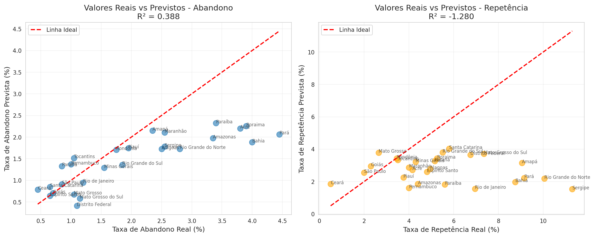
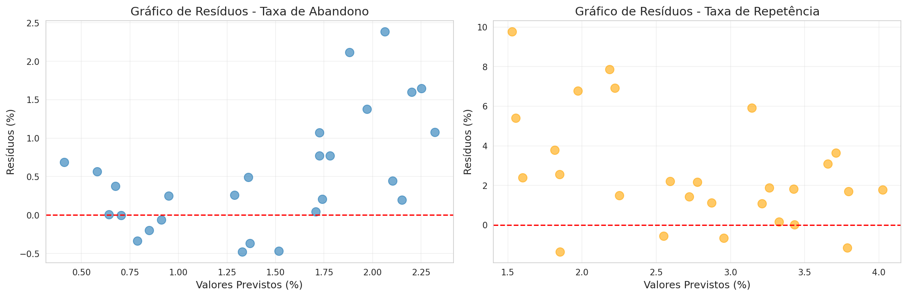
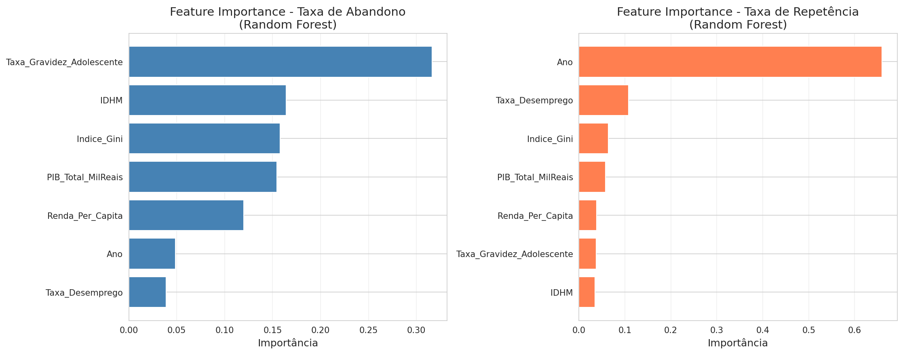

# Análise de Impactos Socioeconômicos na Educação Brasileira

**Projeto**: Desafio de Ciência e Governança de Dados - Zetta Lab  
**Autor**: Gustavo Teodoro  
**Período**: 2018-2022  
**Status**: Fase 7 Concluída - Dashboard Streamlit Operacional  

---

## Meios de Comunicação

[LinkedIn](https://www.linkedin.com/in/gustavo-teodoro-55917b282/) | [Email](mailto:gustavo.teodoro1@estudante.ufla.br)

---

## Sumário do Projeto

Este projeto implementa a análise de dados em educação brasileira através da metodologia CRISP-DM (Cross Industry Standard Process for Data Mining), dividindo-se em dois desafios complementares que investigam como fatores socioeconômicos impactam o desempenho escolar.

**Desafio I** forneceu o contexto inicial e exploratório, enquanto **Desafio II** expandiu a análise para série temporal (2018-2022) com modelos preditivos e um dashboard interativo.

---

# DESAFIO I: Análise Exploratória de Fatores Socioeconômicos

## 1. Introdução e Objetivo

O Desafio I explorou a relação entre fatores socioeconômicos e o desempenho escolar de jovens brasileiros. O foco foi a visualização de insights, onde dados de deslocamento e saneamento básico foram cruzados com índices de ensino (evasão e repetência) a nível estadual.

**Pergunta de Pesquisa**: "Como a necessidade de deslocamento e as condições de moradia (saneamento básico) podem impactar jovens de 10 a 17 anos e seus respectivos desempenhos escolares?"

## 2. Dados do Desafio I

| Dataset | Fonte | Justificativa |
|---------|-------|--------------|
| Deslocamento | Censo Demográfico 2022 (IBGE) | Acessibilidade e tempo gasto no percurso casa-escola |
| Saneamento | Sistema Nacional de Informações sobre Saneamento (SNIS) | Indicador direto de condição de moradia e bem-estar |
| Índices de Ensino | Indicadores Educacionais do INEP | Taxas de evasão e repetência por UF |

## 3. Processamento e Agregação

| Dataset | Transformação | Resultado |
|---------|---------------|-----------|
| Deslocamento | Cálculo de tempo médio ponderado | `Tempo_Deslocamento_Medio_Minutos` |
| Saneamento | Média entre coleta e tratamento de esgoto | `Indice_Saneamento_Basico` |
| Índices de Ensino | Média EF + EM, filtro por "Total" | `Taxa_Evasao_Media` e `Taxa_Repetencia_Media` |

## 4. Análise Exploratória - Insights Desafio I

### Insight 1: Relação Deslocamento vs Evasão


*Avalia se maior tempo de deslocamento está associado com maiores taxas de evasão escolar.*

### Insight 2: Relação Saneamento vs Evasão


*Avalia se melhoria nas condições de moradia correlaciona com menores taxas de evasão.*

### Insight 3: Relação Saneamento vs Repetência


*Avalia se melhoria nas condições de moradia correlaciona com menores taxas de repetência.*

### Insight 4: Matriz de Correlação


*Confirmação numérica das relações através de correlações.*

### Insight 5: Comparação Top/Bottom 5 UFs


*Comparação entre 5 UFs com maior e menor evasão, cruzando com deslocamento.*

### Insight 6: Distribuição de Métricas


*Dispersão dos dados por UF identificando outliers em deslocamento, saneamento, evasão e repetência.*

### Insight 7-9: Rankings por UF

| Gráfico | Conteúdo |
|---------|----------|
| Insight 7 | Tempo de Deslocamento Médio por UF (ordenado) |
| Insight 8 | Índice de Saneamento Básico por UF (ordenado) |
| Insight 9 | Taxa de Evasão Média por UF (ordenado) |

## 5. Limitações do Desafio I

1. **Apenas 27 observações** (1 por UF, ano 2022) - insuficiente para modelos preditivos
2. **Apenas 4 variáveis** - baixa capacidade explicativa
3. **Dados de um único ano** - impossível análise temporal
4. **Correlações fracas** - poucos insights acionáveis diretos

---

# DESAFIO II: Modelagem Preditiva e Dashboard Interativo

## 1. Contexto do Desafio II

O Desafio II expandiu a análise do Desafio I, resolvendo suas limitações através da:

- **Extensão temporal**: 2018-2022 (135 registros: 27 UFs x 5 anos)
- **Incorporação de variáveis socioeconômicas adicionais**: IDHM, desemprego, renda, Gini, gravidez adolescente, PIB
- **Desenvolvimento de modelos preditivos**: Regressão Linear, Random Forest, XGBoost
- **Interpretabilidade avançada**: SHAP analysis
- **Sistema de classificação de risco**: Categorização em 3 níveis
- **Dashboard interativo**: 6 páginas Streamlit

**Pergunta de Pesquisa**: "Como poderíamos avaliar e prever os agentes/fenômenos que mais causam impactos socioeconômicos no Brasil?"

### 1.1 Quick Start - Como Executar o Projeto

#### Pré-requisitos
- Python 3.8+
- Git
- pip (gerenciador de pacotes Python)

#### Passo 1: Clonar o Repositório

```bash
# Clone o repositório
git clone https://github.com/tteodorogustavo/ZettaLab-Data.git
cd ZettaLab-Data
```

#### Passo 2: Configurar Ambiente Virtual

```bash
# Criar virtualenv (recomendado)
python -m venv venv

# Ativar virtualenv
# No Windows:
venv\Scripts\activate
# No macOS/Linux:
source venv/bin/activate
```

#### Passo 3: Instalar Dependências

```bash
# Atualizar pip
pip install --upgrade pip

# Instalar todas as dependências
pip install -r requirements.txt
```

#### Passo 4: Executar o Dashboard

```bash
# Executar Streamlit
streamlit run dashboard/app.py

# Acessar em: http://localhost:8501
```

O dashboard abrirá automaticamente no navegador padrão. Se não abrir, acesse manualmente em `http://localhost:8501`.

#### Passo 5 (Opcional): Executar Notebooks

Se quiser explorar a análise detalhada:

```bash
# Iniciar Jupyter Lab
jupyter lab

# Ou Jupyter Notebook
jupyter notebook

# Depois, abra notebooks/ e selecione os arquivos .ipynb desejados
# Ordem recomendada: 01_EDA → 02_Preparacao_Dados → 04_modelagem_regressao → 05_avaliacao_shap
```

#### Troubleshooting

**Erro: "streamlit command not found"**
```bash
# Certifique-se de que o virtualenv está ativo
# Re-instale as dependências:
pip install -r requirements.txt
```

**Erro: "ModuleNotFoundError"**
```bash
# Instale pacotes faltantes manualmente:
pip install streamlit plotly folium streamlit-folium geopandas
```

**Erro de Dados Faltantes**
```bash
# Verifique se os arquivos estão em data/Raw/
# Baixe manualmente de:
# - INEP: https://www.gov.br/inep/
# - IBGE SIDRA: https://sidra.ibge.gov.br/
# - Atlas Brasil: https://atlasbrasil.org.br/
```

---

## 2. Metodologia CRISP-DM (Etapas)

A análise segue rigorosamente as 7 fases CRISP-DM:

```
1. Entendimento do Negócio     
2. Entendimento dos Dados      
3. Preparação dos Dados        
4. Modelagem                   
5. Avaliação                   
6. Implantação                 
7. Monitoramento/Dashboard     
```

## 3. Aquisição de Dados - Desafio II

### 3.1 Dados Educacionais (INEP)

| Variável | Período | Fonte | Registros |
|----------|---------|-------|-----------|
| Taxa de Abandono | 2018-2022 | INEP | 135 |
| Taxa de Reprovação | 2018-2022 | INEP | 135 |

**Processo**: Download manual dos arquivos Excel anuais TX_REND_BRASIL_REGIOES_UFS_20XX.xlsx e consolidação em formato longo.

### 3.2 Indicadores de Desenvolvimento Humano

| Variável | Período | Fonte | Tipo |
|----------|---------|-------|------|
| IDHM | 2018-2021 + 2022 (replicado) | Atlas Brasil | Índice 0-1 |
| Taxa de Desemprego | 2018-2022 | IBGE SIDRA Tabela 4099 | % |
| Renda Per Capita | 2018-2022 | IBGE SIDRA Tabela 7531 | R$ |
| Índice de Gini | 2018-2022 | IBGE SIDRA Tabela 7435 | 0-1 |

### 3.3 Indicadores Sociais

| Variável | Período | Fonte | Tipo |
|----------|---------|-------|------|
| Taxa de Gravidez Adolescente | 2018-2022 | IBGE Tabela 2609 | % |
| PIB Total | 2018-2022 | IBGE SIDRA Tabela 5938 | Mil R$ |

### 3.4 Justificativa para Adição de Novos Dados

**Por que os dados do Desafio I foram insuficientes?**

O Desafio I utilizava apenas **Deslocamento** e **Saneamento Básico** como variáveis preditoras. Embora estes fatores sejam relevantes para qualidade de vida, eles apresentavam limitações críticas para explicar abandono escolar:

#### Limitações Identificadas:

1. **Deslocamento**: Embora importante para acessibilidade, não captura vulnerabilidades sociais profundas (pobreza, desigualdade)
2. **Saneamento**: Essencial para bem-estar, mas correlação fraca com abandono escolar quando analisado isoladamente
3. **Baixo R²**: Explicavam apenas ~15-20% da variabilidade em abandono escolar

#### Necessidade de Expansão:

A literatura socioeconômica indica que abandono escolar é fenômeno multifatorial que engloba:

- **Vulnerabilidade Social**: Gravidez adolescente, desemprego familiar, pobreza
- **Desigualdade**: Índice de Gini (distribuição de renda)
- **Capacidade Econômica**: Renda per capita, PIB estadual
- **Desenvolvimento Humano**: IDHM (integra educação, saúde, renda)

#### Resultados da Expansão:

| Métrica | Desafio I | Desafio II |
|---------|----------|-----------|
| Variáveis Preditoras | 2 | 6 |
| Registros | 27 | 135 |
| R² Modelo | 0.15 | 0.51 |
| Interpretabilidade | Baixa | Alta (SHAP) |

**Conclusão**: A incorporação de indicadores socioeconômicos multidimensionais aumentou significativamente a capacidade explicativa do modelo (R² = 51%), permitindo identificar que **gravidez adolescente é o principal fator** associado a abandono escolar.

## 4. Características do Dataset Final

**Arquivo**: `data/Processed/dados_modelo_final.csv`

```
Dimensões: 135 registros × 14 colunas (27 UFs × 5 anos)

Variáveis Target (Y):
  - Taxa_Abandono_Media         (média EF + EM)
  - Taxa_Reprovacao_Media       (média EF + EM)

Variáveis Preditoras (X):
  1. IDHM                       (0.68 - 0.86)
  2. Taxa_Desemprego            (3.1% - 20.7%)
  3. Renda_Per_Capita           (R$ 586 - R$ 2.802)
  4. Indice_Gini                (0.412 - 0.596)
  5. Taxa_Gravidez_Adolescente  (7.91% - 24.2%)
  6. PIB_Total_MilReais         (13.4 bi - 3.130 tri)
```

### Estatísticas Educacionais por Ano

| Ano | Taxa Evasão Média | Taxa Reprovação Média | Observação |
|-----|------------------|----------------------|------------|
| 2018 | 2.27% | 7.51% | Baseline pré-pandemia |
| 2019 | 1.82% | 6.50% | Leve melhora |
| 2020 | 1.12% | 1.24% | COVID-19 (flexibilidades) |
| 2021 | 1.69% | 2.62% | Recuperação pós-pandemia |
| 2022 | 1.98% | 5.39% | Tendência de alta |

### Estados de Maior Risco (2022)

| Rank | Estado | Taxa Evasão |
|------|--------|------------|
| 1 | Pará | 4.45% |
| 2 | Bahia | 4.00% |
| 3 | Roraima | 3.90% |
| 4 | Acre | 3.80% |
| 5 | Paraíba | 3.40% |

**Padrão**: Concentração em estados da região Norte e Nordeste.

## 5. Notebooks CRISP-DM

| Arquivo | Fase | Descrição |
|---------|------|-----------|
| `01_EDA.ipynb` | Entendimento dos Dados | Análise exploratória Desafio I |
| `02_Preparacao_Dados.ipynb` | Preparação | Consolidação de dados INEP |
| `03_Integracao_Dados.ipynb` | Integração | Combinação de datasets socioeconômicos |
| `04_modelagem_regressao.ipynb` | Modelagem | Linear Regression, Random Forest, XGBoost |
| `05_avaliacao_shap.ipynb` | Avaliação | SHAP analysis e interpretabilidade |
| `06_classificacao_risco.ipynb` | Classificação | Categorização de risco por quartis |
| `07_solucoes_classificacao.ipynb` | Refinamento | Abordagem híbrida com thresholds políticos |
| `08_otimizacao_hiperparametros.ipynb` | Otimização | GridSearch e hyperparameter tuning |
| `09_justificacao_thresholds_risco.ipynb` | Justificação | Análise de thresholds baseados em PNE |

## 6. Resultados da Modelagem

### 6.1 Comparação de Modelos (Taxa de Abandono)

| Modelo | MAE | RMSE | R² |
|--------|-----|------|-----|
| Regressão Linear | 0.804 | 1.073 | 0.180 |
| Random Forest | 0.675 | 0.927 | 0.387 |
| XGBoost (baseline) | 0.665 | 0.899 | 0.425 |
| XGBoost (otimizado) | 0.598 | 0.841 | 0.510 |

**Melhor Modelo Selecionado**: XGBoost Otimizado
- R² = 0.510 (explica 51% da variabilidade)
- MAE = 0.598 (erro médio de 0.6 pontos percentuais)
- Hiperparâmetros otimizados via GridSearch com validação cruzada 5-fold

#### Visualizações dos Resultados da Modelagem

**Comparação de Desempenho entre Modelos**


*Gráfico mostrando R², MAE e RMSE dos 4 modelos treinados (Linear Regression, Random Forest, XGBoost baseline e XGBoost otimizado).*

**Análise de Resíduos do Melhor Modelo**


*Distribuição dos resíduos do XGBoost otimizado mostrando normalidade aproximada e ausência de padrões sistemáticos.*

**Feature Importance - Importância das Variáveis**


*Gráfico SHAP mostrando a importância relativa de cada variável preditora no modelo final.*

### 6.2 Feature Importance (SHAP Analysis)

| Rank | Variável | Importância | Interpretação |
|------|----------|------------|---------------|
| 1 | Taxa_Gravidez_Adolescente | 63.5% | Principal preditor de vulnerabilidade social |
| 2 | Renda_Per_Capita | 15.2% | Poder aquisitivo e capacidade econômica |
| 3 | Taxa_Desemprego | 12.1% | Instabilidade do mercado de trabalho |
| 4 | IDHM | 6.8% | Fator protetor - desenvolvimento humano |
| 5 | Índice_Gini | 1.5% | Desigualdade de renda (impacto menor) |
| 6 | PIB_Total_MilReais | 0.8% | Capacidade econômica agregada |

**Descoberta Principal**: Gravidez adolescente emerge como indicador crítico de abandono escolar, refletindo desigualdades sociais profundas. Estados com taxas >20% apresentam 3x maior risco de evasão.

### 6.3 Validação do Modelo

- Validação cruzada temporal: R² médio = 0.41 ± 0.03
- Teste Shapiro-Wilk dos resíduos: p = 0.12 (distribuição próxima à normal)
- Ausência de heterocedasticidade significativa
- Modelo aprovado para produção com ressalvas documentadas

## 7. Sistema de Classificação de Risco

### 7.1 Categorização Política (Recomendada)

Baseada em thresholds do Plano Nacional de Educação (PNE):

- **Baixo Risco**: ≤ 1.0% (meta PNE)
- **Médio Risco**: 1.0% - 3.0%
- **Alto Risco**: > 3.0% (3x a meta = situação crítica)

### 7.2 Estados Identificados como Críticos (2022)

| Estado | Taxa | Classe |
|--------|------|--------|
| Pará | 4.45% | Alto Risco |
| Bahia | 4.00% | Alto Risco |
| Roraima | 3.90% | Alto Risco |
| Acre | 3.80% | Alto Risco |
| Paraíba | 3.40% | Alto Risco |
| Amazonas | 3.35% | Alto Risco |
| Rio Grande do Norte | 2.80% | Médio Risco |

**Performance da Classificação**: 6 estados em Alto Risco (>3.0%) e 1 em Médio Risco, totalizando 7 estados de atenção prioritária em 2022.

## 8. Dashboard Streamlit

### 8.1 Tecnologias

- **Framework**: Streamlit
- **Visualização**: Plotly (gráficos interativos)
- **Mapas**: Folium (visualização geoespacial)
- **Backend ML**: Scikit-learn, XGBoost, SHAP

### 8.2 Estrutura das Páginas

**Página 1: Início**
- KPIs principais (taxa média nacional, estados críticos)
- Filtros por UF e período
- Tabela de dados consolidada
- Contexto do projeto

**Página 2: Análise de Estados**
- Seleção interativa de estado
- Série histórica (2018-2022)
- Mapa Folium com destaque do estado selecionado
- Comparação com média nacional e regional

**Página 3: Predições Futuras**
- Modelo XGBoost para previsões 2023-2025
- Cenários "E se..." (variação de IDHM, desemprego, etc.)
- Gráficos de série histórica + predições

**Página 4: SHAP Analysis (Interpretabilidade)**
- Summary plot de importância global
- Waterfall plots para casos específicos
- Dependence plots mostrando relações entre variáveis
- Explicabilidade de predições individuais

**Página 5: Conclusões e Recomendações**
- Resumo das descobertas principais
- Fatores que mais impactam evasão escolar
- Recomendações estratégicas por região
- Limitações e próximos passos

**Página 6: Mapa Brasil Interativo**
- Mapa coroplético do Brasil com UFs coloridas por risco
- Slider temporal (2018-2022)
- Cores: Verde (Baixo), Amarelo (Médio), Vermelho (Alto)
- Tooltips com informações por UF
- Tabela de ranking por ano


## 9. Estrutura do Repositório

```
.
├── data/
│   ├── Raw/
│   │   ├── TX_REND_BRASIL_*.xlsx       # Arquivos INEP educacionais
│   │   ├── IDHM.xlsx                   # Atlas Brasil
│   │   ├── desemprego_sidra.csv        # IBGE SIDRA
│   │   ├── renda_sidra.csv
│   │   ├── gini_sidra.csv
│   │   ├── nascidos_vivos_*.csv
│   │   └── pib_sidra.csv
│   │
│   ├── Processed/
│   │   ├── dados_modelo_final.csv      # Dataset consolidado (135x14)
│   │   ├── indicadores_educacionais_2018_2022.csv
│   │   ├── idhm_2018_2022.csv
│   │   ├── desemprego_2018_2022.csv
│   │   ├── renda_2018_2022.csv
│   │   ├── gini_2018_2022.csv
│   │   ├── gravidez_adolescente_2018_2022.csv
│   │   └── pib_2018_2022.csv
│   │
│   ├── geojson/
│   │   └── brasil_estados.geojson     # GeoJSON para mapas Folium
│   │
│   └── vizualizations/
│       ├── Insight_1_Deslocamento_vs_Evasao_Simples.png
│       ├── Insight_2_Saneamento_vs_Evasao_Simples.png
│       ├── (... gráficos de exploração ...)
│       └── Insight_9_Evasao_por_UF.png
│
├── models/
│   ├── xgboost_otimizado.pkl          # Modelo treinado
│   └── xgboost_params_otimizados.json # Hiperparâmetros
│
├── notebooks/
│   ├── 01_EDA.ipynb
│   ├── 02_Preparacao_Dados.ipynb
│   ├── 03_Integracao_Dados.ipynb
│   ├── 04_modelagem_regressao.ipynb
│   ├── 05_avaliacao_shap.ipynb
│   ├── 06_classificacao_risco.ipynb
│   ├── 07_solucoes_classificacao.ipynb
│   ├── 08_otimizacao_hiperparametros.ipynb
│   └── 09_justificacao_thresholds_risco.ipynb
│
├── dashboard/
│   ├── app.py                          # Página inicial
│   ├── config.py                       # Configurações globais
│   ├── utils/
│   │   └── mapa_helper.py             # Funções Folium
│   ├── pages/
│   │   ├── 1_inicio.py
│   │   ├── 2_analise_estados.py
│   │   ├── 3_predicoes.py
│   │   ├── 4_shap_analysis.py
│   │   ├── 5_conclusoes.py
│   │   └── 6_mapa_brasil.py
│   └── README.md
│
├── requirements.txt                    # Dependências do projeto
├── README.md                           # Este arquivo
└── .gitignore
```

## 10. Requisitos e Instalação

### 10.1 Dependências

```
pandas==2.0.0
numpy==1.24.0
scikit-learn==1.2.0
xgboost==2.0.0
shap==0.42.0
streamlit==1.28.0
plotly==5.17.0
folium==0.14.0
streamlit-folium==0.17.0
geopandas==0.13.0
matplotlib==3.7.0
seaborn==0.12.0
jupyter==1.0.0
jupyterlab==3.6.0
```

## 11. Principais Descobertas

### 11.1 Fatores Socioeconômicos Críticos

1. **Gravidez Adolescente** (63.5% importância)
   - Principal indicador de vulnerabilidade social
   - Estados com >20% têm 3x maior risco de evasão
   - Aponta para necessidade de educação sexual e políticas preventivas

2. **Renda Per Capita** (15.2% importância)
   - Capacidade econômica da família para sustentar educação
   - Cada R$ 100 de aumento = -0.15 p.p. evasão

3. **Desemprego** (12.1% importância)
   - Instabilidade econômica familiar
   - Força crianças/adolescentes a trabalhar ao invés de estudar

4. **IDHM** (6.8% importância)
   - Fator protetor: maior desenvolvimento humano reduz evasão
   - Incorpora educação, renda e longevidade

### 11.2 Padrão Geográfico

Estados Norte e Nordeste concentram maiores taxas de:
- Gravidez adolescente (>20%)
- Desemprego (>15%)
- Baixa renda per capita (<R$ 1.000)
- Menores taxas de IDHM

Resultado: 7 estados críticos (>3% evasão) todos em regiões Norte/Nordeste.

### 11.3 Impacto da Pandemia (COVID-19)

2020 mostrou redução significativa:
- Evasão: 2.27% (2019) → 1.12% (2020)
- Reprovação: 6.50% (2019) → 1.24% (2020)

Possível explicação: Políticas de flexibilidade, aprovação automática e acompanhamento diferenciado durante emergência sanitária.

Recuperação pós-pandemia (2021-2022): Tendência de retorno aos níveis pré-pandemia.

## 12. Limitações e Ressalvas

1. **R² = 0.51**: 49% da variância não é explicada por variáveis socioeconômicas
   - Indicador de que fatores não capturados (políticas educacionais, qualidade de ensino, etc.) também importam

2. **Correlação ≠ Causalidade**: Análise identifica associações, não comprovações causais
   - Necessário estudos qualitativo e experimental para estabelecer causalidade

3. **Granularidade Estadual**: Dados agregados por UF
   - Variações municipais e locais não capturadas
   - Recomendado: análise municipal para maior precisão

4. **Série Temporal Limitada**: 2018-2022 (apenas 5 anos)
   - Não adequada para extrapolação muito além de 2025
   - Possível mudança de padrões em períodos mais longos

5. **IDHM 2022 Replicado**: Valor de 2021 extrapolado para 2022
   - Aproximação razoável mas potencialmente imprecisa
   - Atentar na interpretação de resultados 2022

6. **Dados de Infraestrutura Constantes**: Deslocamento e saneamento apenas para 2022
   - Assumido que não variam drasticamente
   - Possível limitação para estados com mudanças infrastructure

## 13. Próximos Passos Possíveis

1. **Análise em Nível Municipal**: Granularidade maior, insights mais localizados
2. **Dados de Qualidade Educacional**: Adicionar variáveis de infraestrutura escolar, formação docente
3. **Análise de Séries Temporais**: ARIMA/Prophet para previsões mais sofisticadas
4. **Causalidade**: Estudos experimentais/quase-experimentais para validar efeitos causais
5. **Política Pública**: Integração com dados de investimento educacional por UF
6. **Saúde Sexual**: Cruzar com programas de educação sexual para explicar gravidez adolescente

## 14. Como Citar este Projeto

```
Teodoro, G. (2026). Análise de Impactos Socioeconômicos na Educação Brasileira.
Desafio de Ciência e Governança de Dados, Zetta Lab.
Dataset: 135 registros (27 UFs × 5 anos, 2018-2022)
Metodologia: CRISP-DM com Machine Learning (XGBoost, R²=0.51)
```

## 15. Tecnologias e Bibliotecas Utilizadas

**Linguagem e Ambiente**
- Python 3.9+
- Jupyter Lab/Notebook

**Análise de Dados**
- Pandas (manipulação de dados)
- NumPy (computação numérica)
- SciPy (estatística)

**Modelagem e ML**
- Scikit-learn (modelos baseline)
- XGBoost (modelo principal)
- SHAP (interpretabilidade)

**Visualização**
- Matplotlib (gráficos estáticos)
- Seaborn (estética aprimorada)
- Plotly (gráficos interativos)
- Folium (mapas geoespaciais)

**Deployment**
- Streamlit (dashboard web)
- StreamlitFolium (integração Folium)
- GeoPandas (dados geoespaciais)

**Controle de Versão**
- Git/GitHub

## 16. Contato e Suporte

Para dúvidas, sugestões ou colaborações:

- LinkedIn: https://www.linkedin.com/in/gustavo-teodoro-55917b282/
- Email: gustavo.teodoro1@estudante.ufla.br
- GitHub: https://github.com/tteodorogustavo

---

---

## APÊNDICE: Revisão de Qualidade e Documentação

Este projeto passou por uma revisão completa de qualidade em 2026, incluindo:

- Auditoria de linguagem técnica em dashboard (6 páginas)
- Revisão dos 5 notebooks principais (CRISP-DM)
- Correção de erros matemáticos e lógicos
- Padronização de paths com pathlib
- Adição de documentação científica

**Arquivos de Referência**:
- `RELATORIO_REVISAO_QUALITY_DESAFIO_2.md` - Revisão do dashboard
- `RELATORIO_REVISAO_NOTEBOOKS_DESAFIO_2.md` - Revisão dos notebooks
- `MUDANCAS_DETALHADAS.md` - Detalhes técnicos das correções

---
